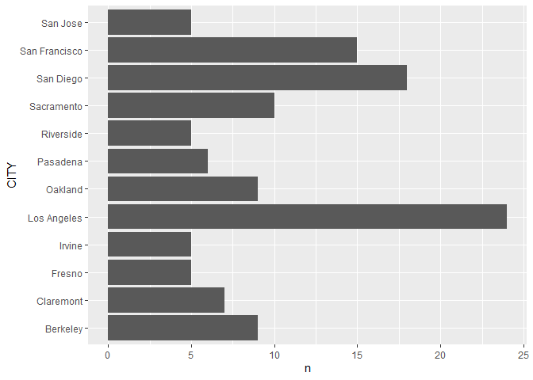
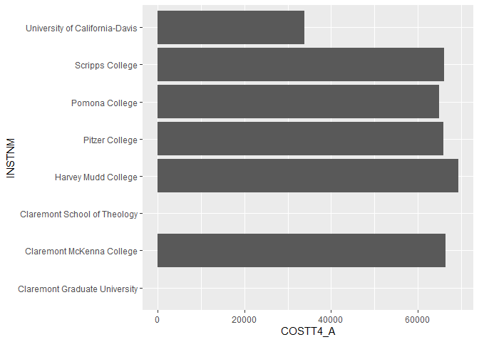
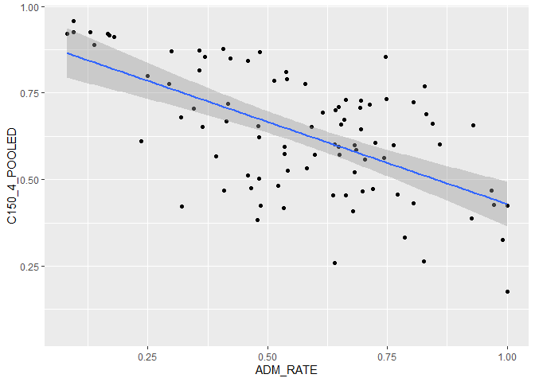
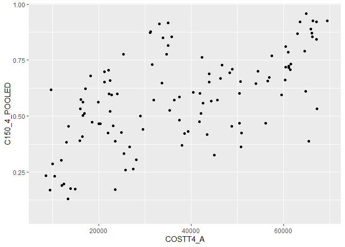
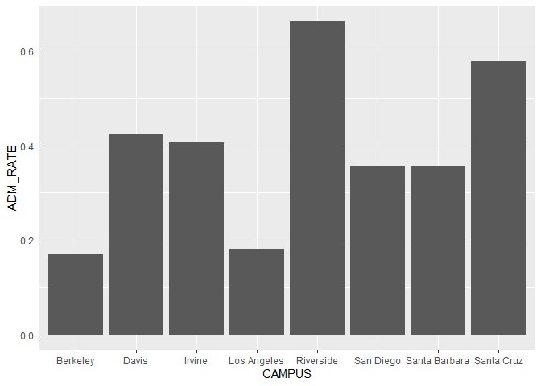

## Instructions
Answer the following questions and complete the exercises in RMarkdown. Please embed all of your code and push your final work to your repository. Your final lab report should be organized, clean, and run free from errors. Remember, you must remove the `#` for the included code chunks to run. Be sure to add your name to the author header above.  

Make sure to use the formatting conventions of RMarkdown to make your report neat and clean!  

## Load the libraries

```r
library(tidyverse)
library(janitor)
library(here)
library(naniar)
```

For this homework, we will take a departure from biological data and use data about California colleges. These data are a subset of the national college scorecard (https://collegescorecard.ed.gov/data/). Load the `ca_college_data.csv` as a new object called `colleges`.

```r
colleges <- read_csv("data/ca_college_data.csv")
```

```
## Rows: 341 Columns: 10
## ── Column specification ────────────────────────────────────────────────────────
## Delimiter: ","
## chr (4): INSTNM, CITY, STABBR, ZIP
## dbl (6): ADM_RATE, SAT_AVG, PCIP26, COSTT4_A, C150_4_POOLED, PFTFTUG1_EF
## 
## ℹ Use `spec()` to retrieve the full column specification for this data.
## ℹ Specify the column types or set `show_col_types = FALSE` to quiet this message.
```

The variables are a bit hard to decipher, here is a key:  

INSTNM: Institution name  
CITY: California city  
STABBR: Location state  
ZIP: Zip code  
ADM_RATE: Admission rate  
SAT_AVG: SAT average score  
PCIP26: Percentage of degrees awarded in Biological And Biomedical Sciences  
COSTT4_A: Annual cost of attendance  
C150_4_POOLED: 4-year completion rate  
PFTFTUG1_EF: Percentage of undergraduate students who are first-time, full-time degree/certificate-seeking undergraduate students  

1. Use your preferred function(s) to have a look at the data and get an idea of its structure. Make sure you summarize NA's and determine whether or not the data are tidy. You may also consider dealing with any naming issues.


```r
glimpse(colleges)
```

```
## Rows: 341
## Columns: 10
## $ INSTNM        <chr> "Grossmont College", "College of the Sequoias", "College…
## $ CITY          <chr> "El Cajon", "Visalia", "San Mateo", "Ventura", "Oxnard",…
## $ STABBR        <chr> "CA", "CA", "CA", "CA", "CA", "CA", "CA", "CA", "CA", "C…
## $ ZIP           <chr> "92020-1799", "93277-2214", "94402-3784", "93003-3872", …
## $ ADM_RATE      <dbl> NA, NA, NA, NA, NA, NA, NA, NA, NA, NA, NA, NA, NA, NA, …
## $ SAT_AVG       <dbl> NA, NA, NA, NA, NA, NA, NA, NA, NA, NA, NA, NA, NA, NA, …
## $ PCIP26        <dbl> 0.0016, 0.0066, 0.0038, 0.0035, 0.0085, 0.0151, 0.0000, …
## $ COSTT4_A      <dbl> 7956, 8109, 8278, 8407, 8516, 8577, 8580, 9181, 9281, 93…
## $ C150_4_POOLED <dbl> NA, NA, NA, NA, NA, NA, 0.2334, NA, NA, NA, NA, 0.1704, …
## $ PFTFTUG1_EF   <dbl> 0.3546, 0.5413, 0.3567, 0.3824, 0.2753, 0.4286, 0.2307, …
```

```r
miss_var_summary(colleges)
```

```
## # A tibble: 10 × 3
##    variable      n_miss pct_miss
##    <chr>          <int>    <dbl>
##  1 SAT_AVG          276     80.9
##  2 ADM_RATE         240     70.4
##  3 C150_4_POOLED    221     64.8
##  4 COSTT4_A         124     36.4
##  5 PFTFTUG1_EF       53     15.5
##  6 PCIP26            35     10.3
##  7 INSTNM             0      0  
##  8 CITY               0      0  
##  9 STABBR             0      0  
## 10 ZIP                0      0
```


2. Which cities in California have the highest number of colleges?


```r
colleges %>% 
  count(CITY) %>% 
  arrange(desc(n))
```

```
## # A tibble: 161 × 2
##    CITY              n
##    <chr>         <int>
##  1 Los Angeles      24
##  2 San Diego        18
##  3 San Francisco    15
##  4 Sacramento       10
##  5 Berkeley          9
##  6 Oakland           9
##  7 Claremont         7
##  8 Pasadena          6
##  9 Fresno            5
## 10 Irvine            5
## # ℹ 151 more rows
```

3. Based on your answer to #2, make a plot that shows the number of colleges in the top 10 cities.


```r
colleges %>% 
  count(CITY) %>% 
  arrange(desc(n)) %>% 
  top_n(10,n) %>% 
  ggplot(aes(y=CITY, x=n))+
  geom_col()
```

<!-- -->
Frenso, Irvine, Riverside, San Jose all had a value of 5, so thats why the plot depicts 12 cities rather than just 10 since 4 cities tie for 10th place. 

4. The column `COSTT4_A` is the annual cost of each institution. Which city has the highest average cost? Where is it located?


```r
colleges %>% 
  group_by(CITY) %>% 
  summarize(average_cost = mean(COSTT4_A, na.rm=T)) %>% 
  arrange(desc(average_cost))
```

```
## # A tibble: 161 × 2
##    CITY                average_cost
##    <chr>                      <dbl>
##  1 Claremont                  66498
##  2 Malibu                     66152
##  3 Valencia                   64686
##  4 Orange                     64501
##  5 Redlands                   61542
##  6 Moraga                     61095
##  7 Atherton                   56035
##  8 Thousand Oaks              54373
##  9 Rancho Palos Verdes        50758
## 10 La Verne                   50603
## # ℹ 151 more rows
```
The city with the highest average cost is Claremont with average cost of $66,498.00 located in CA. 

5. Based on your answer to #4, make a plot that compares the cost of the individual colleges in the most expensive city. Bonus! Add UC Davis here to see how it compares :>).


```r
colleges %>% 
  filter(CITY == "Claremont"| CITY =="Davis") %>% 
  ggplot(aes(y=INSTNM, x=COSTT4_A))+
  geom_col(na.rm=T)
```

```
## Warning: Removed 2 rows containing missing values (`position_stack()`).
```

<!-- -->


6. The column `ADM_RATE` is the admissions rate by college and `C150_4_POOLED` is the four-year completion rate. Use a scatterplot to show the relationship between these two variables. What do you think this means?


```r
colleges %>% 
  ggplot(aes(x= ADM_RATE, y= C150_4_POOLED))+
  geom_point(na.rm=T)+
  geom_smooth(method=lm, se=T)
```

```
## `geom_smooth()` using formula = 'y ~ x'
```

```
## Warning: Removed 251 rows containing non-finite values (`stat_smooth()`).
```

<!-- -->

From this scatter plot, it appears that as the admission rates of colleges go up the four year completion rate is going down. 

7. Is there a relationship between cost and four-year completion rate? (You don't need to do the stats, just produce a plot). What do you think this means?


```r
colleges %>% 
  ggplot(aes(x= COSTT4_A, y= C150_4_POOLED))+
  geom_point(na.rm=T)
```

<!-- -->
There appears to be a positive correlation where as cost goes up so does the four year completion rate.  

8. The column titled `INSTNM` is the institution name. We are only interested in the University of California colleges. Make a new data frame that is restricted to UC institutions. You can remove `Hastings College of Law` and `UC San Francisco` as we are only interested in undergraduate institutions.


```r
uc_calif_final <- colleges %>% 
  filter(str_starts(INSTNM,"University of California")) %>% 
  top_n(8,ADM_RATE)
```


Remove `Hastings College of Law` and `UC San Francisco` and store the final data frame as a new object `univ_calif_final`.

Use `separate()` to separate institution name into two new columns "UNIV" and "CAMPUS".


```r
uc_calif_final <- uc_calif_final %>% 
  separate(INSTNM, into=c("UNIV","CAMPUS"), sep="-")
```


9. The column `ADM_RATE` is the admissions rate by campus. Which UC has the lowest and highest admissions rates? Produce a numerical summary and an appropriate plot.


```r
uc_calif_final %>% 
  select(CAMPUS, ADM_RATE) %>% 
  arrange(desc(ADM_RATE))
```

```
## # A tibble: 8 × 2
##   CAMPUS        ADM_RATE
##   <chr>            <dbl>
## 1 Riverside        0.663
## 2 Santa Cruz       0.578
## 3 Davis            0.423
## 4 Irvine           0.406
## 5 Santa Barbara    0.358
## 6 San Diego        0.357
## 7 Los Angeles      0.180
## 8 Berkeley         0.169
```

```r
uc_calif_final %>% 
  select(CAMPUS, ADM_RATE) %>% 
  ggplot(aes(x=CAMPUS,y=ADM_RATE))+
  geom_col()
```

<!-- -->
Berkeley has the lowest admission rate and riverside has the highest admission rate. 

10. If you wanted to get a degree in biological or biomedical sciences, which campus confers the majority of these degrees? Produce a numerical summary and an appropriate plot.


```r
uc_calif_final %>% 
  select(CAMPUS, PCIP26) %>% 
  arrange(desc(PCIP26))
```

```
## # A tibble: 8 × 2
##   CAMPUS        PCIP26
##   <chr>          <dbl>
## 1 San Diego      0.216
## 2 Davis          0.198
## 3 Santa Cruz     0.193
## 4 Los Angeles    0.155
## 5 Riverside      0.149
## 6 Santa Barbara  0.108
## 7 Irvine         0.107
## 8 Berkeley       0.105
```

```r
uc_calif_final %>% 
  select(CAMPUS, PCIP26) %>% 
  ggplot(aes(x=CAMPUS,y=PCIP26))+
  geom_col()
```

<!-- -->
UC San Diego has the most degrees in biological and bio medical sciences. 

## Knit Your Output and Post to [GitHub](https://github.com/FRS417-DataScienceBiologists)
