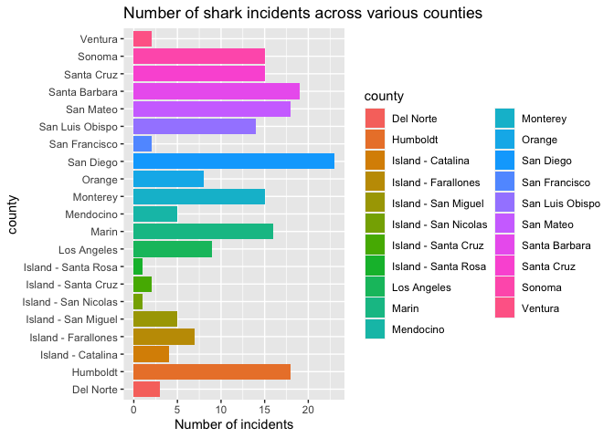
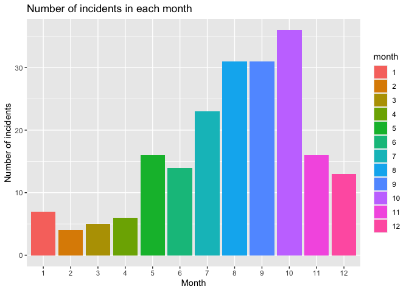
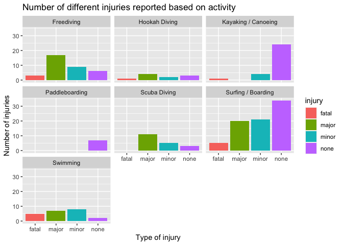
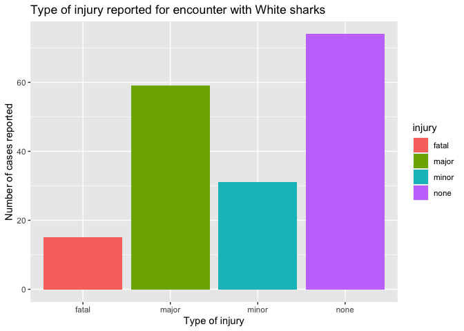
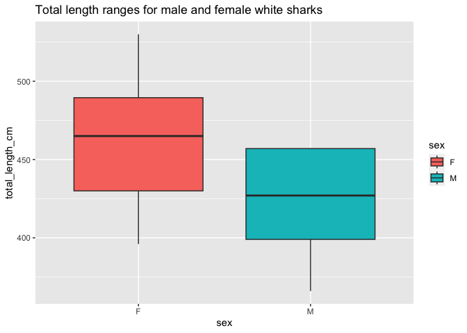
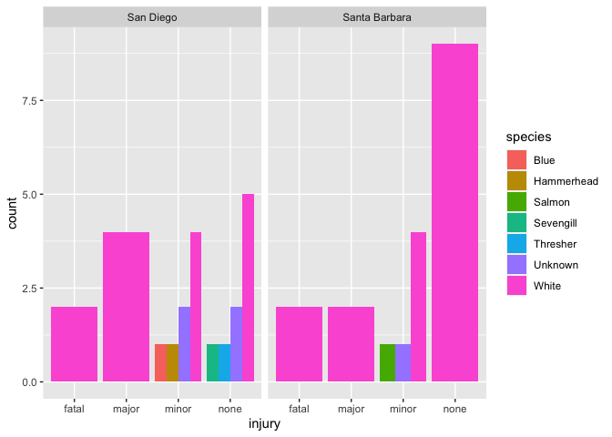

## Instructions
Answer the following questions and complete the exercises in RMarkdown. Please embed all of your code and push your final work to your repository. Your code must be organized, clean, and run free from errors. Remember, you must remove the `#` for any included code chunks to run. Be sure to add your name to the author header above. 

Your code must knit in order to be considered. If you are stuck and cannot answer a question, then comment out your code and knit the document. You may use your notes, labs, and homework to help you complete this exam. Do not use any other resources- including AI assistance.  

Don't forget to answer any questions that are asked in the prompt. Some questions will require a plot, but others do not- make sure to read each question carefully.  

For the questions that require a plot, make sure to have clearly labeled axes and a title. Keep your plots clean and professional-looking, but you are free to add color and other aesthetics.  

Be sure to follow the directions and upload your exam on Gradescope.    

## Background
In the `data` folder, you will find data about shark incidents in California between 1950-2022. The [data](https://catalog.data.gov/dataset/shark-incident-database-california-56167) are from: State of California- Shark Incident Database.   

## Load the libraries

```r
library("tidyverse")
library("janitor")
library("naniar")
```

## Load the data
Run the following code chunk to import the data.

```r
sharks <- read_csv("data/SharkIncidents_1950_2022_220302.csv") %>% clean_names()
```

## Questions
1. (1 point) Start by doing some data exploration using your preferred function(s). What is the structure of the data? Where are the missing values and how are they represented?  


```r
glimpse(sharks)
```

```
## Rows: 211
## Columns: 16
## $ incident_num     <chr> "1", "2", "3", "4", "5", "6", "7", "8", "9", "10", "1…
## $ month            <dbl> 10, 5, 12, 2, 8, 4, 10, 5, 6, 7, 10, 11, 4, 5, 5, 8, …
## $ day              <dbl> 8, 27, 7, 6, 14, 28, 12, 7, 14, 28, 4, 10, 24, 19, 21…
## $ year             <dbl> 1950, 1952, 1952, 1955, 1956, 1957, 1958, 1959, 1959,…
## $ time             <chr> "12:00", "14:00", "14:00", "12:00", "16:30", "13:30",…
## $ county           <chr> "San Diego", "San Diego", "Monterey", "Monterey", "Sa…
## $ location         <chr> "Imperial Beach", "Imperial Beach", "Lovers Point", "…
## $ mode             <chr> "Swimming", "Swimming", "Swimming", "Freediving", "Sw…
## $ injury           <chr> "major", "minor", "fatal", "minor", "major", "fatal",…
## $ depth            <chr> "surface", "surface", "surface", "surface", "surface"…
## $ species          <chr> "White", "White", "White", "White", "White", "White",…
## $ comment          <chr> "Body Surfing, bit multiple times on leg, thigh and b…
## $ longitude        <chr> "-117.1466667", "-117.2466667", "-122.05", "-122.15",…
## $ latitude         <dbl> 32.58833, 32.58833, 36.62667, 36.62667, 35.13833, 35.…
## $ confirmed_source <chr> "Miller/Collier, Coronado Paper, Oceanside Paper", "G…
## $ wfl_case_number  <chr> NA, NA, NA, NA, NA, NA, NA, NA, NA, NA, NA, NA, NA, N…
```

```r
miss_var_summary(sharks)
```

```
## # A tibble: 16 × 3
##    variable         n_miss pct_miss
##    <chr>             <int>    <dbl>
##  1 wfl_case_number     202   95.7  
##  2 time                  7    3.32 
##  3 latitude              6    2.84 
##  4 longitude             5    2.37 
##  5 confirmed_source      1    0.474
##  6 incident_num          0    0    
##  7 month                 0    0    
##  8 day                   0    0    
##  9 year                  0    0    
## 10 county                0    0    
## 11 location              0    0    
## 12 mode                  0    0    
## 13 injury                0    0    
## 14 depth                 0    0    
## 15 species               0    0    
## 16 comment               0    0
```


2. (1 point) Notice that there are some incidents identified as "NOT COUNTED". These should be removed from the data because they were either not sharks, unverified, or were provoked. It's OK to replace the `sharks` object.


```r
sharks <- sharks %>% 
  filter(incident_num != "NOT COUNTED")
```

3. (3 points) Are there any "hotspots" for shark incidents in California? Make a plot that shows the total number of incidents per county. Which county has the highest number of incidents?


```r
sharks %>% 
  count(county) %>% 
  ggplot(aes(x=county, y=n, fill=county))+
  geom_col()+
  labs(title= "Number of shark incidents across various counties", 
       x= "county", y="Number of incidents")+
  coord_flip()
```

<!-- -->


```r
sharks %>% 
  count(county, sort=T)
```

```
## # A tibble: 21 × 2
##    county              n
##    <chr>           <int>
##  1 San Diego          23
##  2 Santa Barbara      19
##  3 Humboldt           18
##  4 San Mateo          18
##  5 Marin              16
##  6 Monterey           15
##  7 Santa Cruz         15
##  8 Sonoma             15
##  9 San Luis Obispo    14
## 10 Los Angeles         9
## # ℹ 11 more rows
```

San Diego county has the most number of shark incidents reported in this dataset. 


4. (3 points) Are there months of the year when incidents are more likely to occur? Make a plot that shows the total number of incidents by month. Which month has the highest number of incidents?  


```r
sharks %>% 
  count(month) %>% 
  mutate(month = as.factor(month)) %>% 
  ggplot(aes(x=month, y=n, fill=month))+
  geom_col()+
  labs(title= "Number of incidents in each month",
       x= "Month", y="Number of incidents")
```

<!-- -->


```r
sharks %>% 
  count(month, sort=T)
```

```
## # A tibble: 12 × 2
##    month     n
##    <dbl> <int>
##  1    10    36
##  2     8    31
##  3     9    31
##  4     7    23
##  5     5    16
##  6    11    16
##  7     6    14
##  8    12    13
##  9     1     7
## 10     4     6
## 11     3     5
## 12     2     4
```
Month 10 or October has the most number of incidents. 


5. (3 points) How do the number and types of injuries compare by county? Make a table (not a plot) that shows the number of injury types by county. Which county has the highest number of fatalities?  


```r
sharks %>% 
  count(county, injury) %>% 
  filter(injury=="fatal") %>% 
  arrange(desc(n))
```

```
## # A tibble: 10 × 3
##    county              injury     n
##    <chr>               <chr>  <int>
##  1 San Luis Obispo     fatal      3
##  2 Monterey            fatal      2
##  3 San Diego           fatal      2
##  4 Santa Barbara       fatal      2
##  5 Island - San Miguel fatal      1
##  6 Los Angeles         fatal      1
##  7 Mendocino           fatal      1
##  8 San Francisco       fatal      1
##  9 San Mateo           fatal      1
## 10 Santa Cruz          fatal      1
```
San Luis Obispo has the most number of fatal injuries at 3. 

This table below shows the type of injuries by county. 

```r
sharks %>% 
  count(county, injury)
```

```
## # A tibble: 57 × 3
##    county              injury     n
##    <chr>               <chr>  <int>
##  1 Del Norte           minor      2
##  2 Del Norte           none       1
##  3 Humboldt            major      7
##  4 Humboldt            minor      2
##  5 Humboldt            none       9
##  6 Island - Catalina   minor      1
##  7 Island - Catalina   none       3
##  8 Island - Farallones major      7
##  9 Island - San Miguel fatal      1
## 10 Island - San Miguel major      2
## # ℹ 47 more rows
```


6. (2 points) In the data, `mode` refers to a type of activity. Which activity is associated with the highest number of incidents?


```r
sharks %>% 
  count(mode, sort=T)
```

```
## # A tibble: 7 × 2
##   mode                    n
##   <chr>               <int>
## 1 Surfing / Boarding     80
## 2 Freediving             35
## 3 Kayaking / Canoeing    29
## 4 Swimming               22
## 5 Scuba Diving           19
## 6 Hookah Diving          10
## 7 Paddleboarding          7
```
Surfing/Boarding is associated with the highest number of incidents with a value of 80. 

7. (4 points) Use faceting to make a plot that compares the number and types of injuries by activity. (hint: the x axes should be the type of injury) 


```r
sharks %>% 
  ggplot(aes(x=injury, fill=injury))+
  geom_bar()+
  facet_wrap(~mode)+
  labs(title= "Number of different injuries reported based on activity", 
       x= "Type of injury", y="Number of injuries")
```

<!-- -->


8. (1 point) Which shark species is involved in the highest number of incidents?  


```r
sharks %>% 
  count(species, sort=T)
```

```
## # A tibble: 8 × 2
##   species        n
##   <chr>      <int>
## 1 White        179
## 2 Unknown       13
## 3 Hammerhead     3
## 4 Blue           2
## 5 Leopard        2
## 6 Salmon         1
## 7 Sevengill      1
## 8 Thresher       1
```

White shark is reported with the most number of incidents. 

9. (3 points) Are all incidents involving Great White's fatal? Make a plot that shows the number and types of injuries for Great White's only.  


```r
sharks %>% 
  filter(species == "White") %>% 
  ggplot(aes(x=injury, fill=injury))+
  geom_bar()+
  labs(title= "Type of injury reported for encounter with White sharks", 
       x="Type of injury", y="Number of cases reported")
```

<!-- -->

No not all of the injuries reported by white sharks are fatal. Most encounters lead to no injuries. 

## Background
Let's learn a little bit more about Great White sharks by looking at a small dataset that tracked 20 Great White's in the Fallaron Islands. The [data](https://link.springer.com/article/10.1007/s00227-007-0739-4) are from: Weng et al. (2007) Migration and habitat of white sharks (_Carcharodon carcharias_) in the eastern Pacific Ocean.

## Load the data

```r
white_sharks <- read_csv("data/White sharks tracked from Southeast Farallon Island, CA, USA, 1999 2004.csv", na = c("?", "n/a")) %>% clean_names()
```

10. (1 point) Start by doing some data exploration using your preferred function(s). What is the structure of the data? Where are the missing values and how are they represented?


```r
glimpse(white_sharks)
```

```
## Rows: 20
## Columns: 10
## $ shark           <chr> "1-M", "2-M", "3-M", "4-M", "5-F", "6-M", "7-F", "8-M"…
## $ tagging_date    <chr> "19-Oct-99", "30-Oct-99", "16-Oct-00", "5-Nov-01", "5-…
## $ total_length_cm <dbl> 402, 366, 457, 457, 488, 427, 442, 380, 450, 530, 427,…
## $ sex             <chr> "M", "M", "M", "M", "F", "M", "F", "M", "M", "F", NA, …
## $ maturity        <chr> "Mature", "Adolescent", "Mature", "Mature", "Mature", …
## $ pop_up_date     <chr> "2-Nov-99", "25-Nov-99", "16-Apr-01", "6-May-02", "19-…
## $ track_days      <dbl> 14, 26, 182, 182, 256, 275, 35, 60, 209, 91, 182, 240,…
## $ longitude       <dbl> -124.49, -125.97, -156.80, -141.47, -133.25, -138.83, …
## $ latitude        <dbl> 38.95, 38.69, 20.67, 26.39, 21.13, 26.50, 37.07, 34.93…
## $ comment         <chr> "Nearshore", "Nearshore", "To Hawaii", "To Hawaii", "O…
```

```r
miss_var_summary(white_sharks)
```

```
## # A tibble: 10 × 3
##    variable        n_miss pct_miss
##    <chr>            <int>    <dbl>
##  1 sex                  3       15
##  2 maturity             1        5
##  3 longitude            1        5
##  4 latitude             1        5
##  5 shark                0        0
##  6 tagging_date         0        0
##  7 total_length_cm      0        0
##  8 pop_up_date          0        0
##  9 track_days           0        0
## 10 comment              0        0
```

11. (3 points) How do male and female sharks compare in terms of total length? Are males or females larger on average? Do a quick search online to verify your findings. (hint: this is a table, not a plot).  


```r
white_sharks %>% 
  filter(sex != "NA") %>% 
  group_by(sex) %>% 
  summarize(averge_length=mean(total_length_cm))
```

```
## # A tibble: 2 × 2
##   sex   averge_length
##   <chr>         <dbl>
## 1 F              462 
## 2 M              425.
```

Females white sharks are larger on average than male sharks. Yes this is confirmed as avergae female can be 15-16 feet long while males reach from 11-13 feet long. [source](https://ocean.si.edu/ocean-life/sharks-rays/how-big-are-great-white-sharks)

12. (3 points) Make a plot that compares the range of total length by sex.


```r
white_sharks %>% 
  filter(sex != "NA") %>% 
  ggplot(aes(x=sex, y=total_length_cm, fill=sex))+
  geom_boxplot()+
  labs(title = "Total length ranges for male and female white sharks")
```

<!-- -->


13. (2 points) Using the `sharks` or the `white_sharks` data, what is one question that you are interested in exploring? Write the question and answer it using a plot or table.  

I want to use the sharks database to determine the type of injury caused by each type of shark species in the two counties with the most number of reported incidents. 


```r
sharks %>% 
  count(county) %>% 
  top_n(2)
```

```
## Selecting by n
```

```
## # A tibble: 2 × 2
##   county            n
##   <chr>         <int>
## 1 San Diego        23
## 2 Santa Barbara    19
```

```r
sharks %>% 
  filter(county == "Santa Barbara"|county== "San Diego") %>% 
  ggplot(aes(x=injury, fill = species))+
  geom_bar(position = "dodge")+
  facet_wrap(~county)
```

<!-- -->

From this data set, it appears that white sharks are the only species that have caused major or fatal injuries during incidents reported in both counties. All other species have only led to either minor injuries or no injuries reported at all. San Diego has more fatal and major injuries reported than Santa Barbara. 
